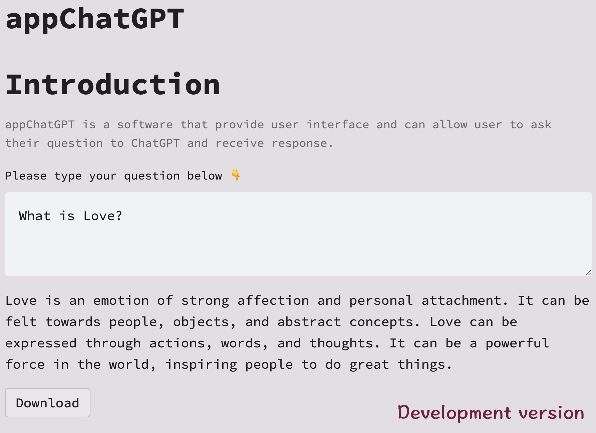

# appChatGPT

This project is to provide a user-interface to interact with [ChatGPT](https://openai.com/blog/chatgpt/). 
You are able to type question(s) in the text box, get answer(s), and download your question(s)&answer(s) as a text file. 



## Installation

### Clone this repository

```shell
git clone https://github.com/ferygood/appChatGPT/tree/main/myGPT
```
### set virtual environment

### set ChatGPT token key
[Best Practives for API Key Safety](https://help.openai.com/en/articles/5112595-best-practices-for-api-key-safety)
It is required to set your API token key locally to use appChatGPT. Please do not commit your token key on github or 
other similar version control platform. 

## How to use appChatGPT

```python
streamlit run app.py
```

